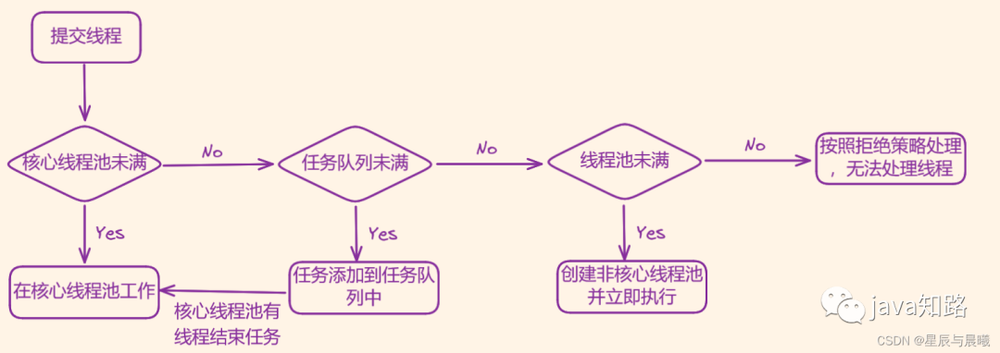

Java 线程池的工作原理
java知路 java知路 2023-06-03 10:00 发表于湖北
文章目录

概念

线程中的基本方法

线程复用

线程池的核心组件和核心类

线程池的工作原理

线程池中的workQueue任务队列

直接提交队列(SynchronousQueue)

有界任务队列(ArrayBlockingQueue)

无界任务队列(LinkedBlockingQueue)

优先任务队列(PriorityBlockingQueue)

线程池的拒绝策略

常见的线程池

newCachedThreadPool

newFixedThreadPool

newScheduledThreadPool

newSinglesThreadExecutor

newWorkStealingPool


概念

Java 线程池主要是用于管理线程组及其运行状态，以便 Java 虚拟机更好地利用 CPU 资源。

Java 线程池的工作原理为：JVM 先根据用户的参数创建一定数量的可运行的线程任务，并将其放入队列当中，在线程创建好后启动这些任务，如果正在运行的线程数量超过了线程池的最大线程数量（线程池的数量是用户自己设置的），那么超出的数量的线程排队等待，在有任务执行完毕后，线程池调度器会发现有可用的线程，进而再次从队列中取出任务并执行。

线程池的主要作用就是线程复用，线程资源管理，控制操作系统的最大并发数，以保证系统的高效（通过线程资源复用实现）且安全（通过控制最大线程并发数实现）地运行。

线程池优点:

重复利用线程，降低线程创建和销毁带来的资源消耗

统一管理线程，线程的创建和销毁都由线程池进行管理

提高响应速度，线程创建已经完成，任务来到可直接处理，省去了创建时间

线程中的基本方法

提交线程任务

threadPool.submit(Runnable task)
关闭线程任务

threadPool.shutdown()
这个方法线程池不会立即关闭，而是会等到所有线程执行完毕，还有阻塞队列中的任务执行完毕后，再关闭。在此期间，线程池也会启用拒绝策略,拒绝新的任务提交。

threadPool.shutdownNow()
它会给所有线程发送 interrupt信号，尝试中断这些任务，然后将任务队列中的任务转移到一个list中并返回，接下来就看你要不要处理了。说通俗一点就是关闭所有的线程。

线程复用

在 Java 当中线程池里的每一个线程代码结束后，并不会死亡，而是再次回到线程池中成为空闲状态，等待下一个对象来使用。在 JDK5 之前，我们必须手动实现自己的线程池，从 JDK5 开始，Java 内置支持线程池。

在Java 当中，每个Thread 线程都有一个 start 方法，在程序调用 start 方法启动线程时，Java 虚拟机会调用该类的 run 方法。在 Thread 类的run 方法中其实调用了 Runnable 对象的 run 方法，因此可以继承 Thread 类，在 start 方法中不断循环调用传递进来的 Runnable 对象，程序就会不断地执行 run 方法中的代码。

可以将在循环方法中不断获取的 Runnable 对象存放在 Queue 中，当线程在获取下一个 Runnable 对象之前可以是阻塞的，这样既能有效控制正在执行的线程个数，也能保证系统正在等待执行的其他线程有序执行。这样就简单实现了一个线程池，达到了线程复用的效果。

线程池的核心组件和核心类

在 Java 线程池当中主要由以下 4 个核心组件组成

线程池管理器：用于创建并管理线程池

工作线程：线程池中执行具体任务的线程

任务接口：用于定义工作线程的调度和执行策略，只有下线程实现了该接口，线程中的任务才能够被线程池调度。

任务队列：存放待处理的任务，新的任务将会不断被加入队列中，执行完成的任务将会从队列中移除。

Java 中的线程池是通过 Executor 框架来实现的，在该线程中用到了 Executor、Executors、ExecutorService、ThreadPoolExecutor、Callable、Future、FutureTask 这几个核心类。

其中，ThreadPoolExecutor 是构建线程的核心方法。且在ThreadPoolExecutor 类当中是由4个它的构造方法

public ThreadPoolExecutor(int corePoolSize,
int maximumPoolSize,
long keepAliveTime,
TimeUnit unit,
BlockingQueue<Runnable> workQueue) {
this(corePoolSize, maximumPoolSize, keepAliveTime, unit, workQueue,
Executors.defaultThreadFactory(), defaultHandler);
}

    public ThreadPoolExecutor(int corePoolSize,
                              int maximumPoolSize,
                              long keepAliveTime,
                              TimeUnit unit,
                              BlockingQueue<Runnable> workQueue,
                              ThreadFactory threadFactory) {
        this(corePoolSize, maximumPoolSize, keepAliveTime, unit, workQueue,
             threadFactory, defaultHandler);
    }
    
    public ThreadPoolExecutor(int corePoolSize,
                              int maximumPoolSize,
                              long keepAliveTime,
                              TimeUnit unit,
                              BlockingQueue<Runnable> workQueue,
                              RejectedExecutionHandler handler) {
        this(corePoolSize, maximumPoolSize, keepAliveTime, unit, workQueue,
             Executors.defaultThreadFactory(), handler);
    }
    
    public ThreadPoolExecutor(int corePoolSize,
                              int maximumPoolSize,
                              long keepAliveTime,
                              TimeUnit unit,
                              BlockingQueue<Runnable> workQueue,
                              ThreadFactory threadFactory,
                              RejectedExecutionHandler handler) {
        if (corePoolSize < 0 ||
            maximumPoolSize <= 0 ||
            maximumPoolSize < corePoolSize ||
            keepAliveTime < 0)
            throw new IllegalArgumentException();
        if (workQueue == null || threadFactory == null || handler == null)
            throw new NullPointerException();
        this.acc = System.getSecurityManager() == null ?
                null :
                AccessController.getContext();
        this.corePoolSize = corePoolSize;
        this.maximumPoolSize = maximumPoolSize;
        this.workQueue = workQueue;
        this.keepAliveTime = unit.toNanos(keepAliveTime);
        this.threadFactory = threadFactory;
        this.handler = handler;
    }
ThreadPoolExecutor 继承了 AbstractExecutorService 类，并提供了四个构造器，事实上，通过观察每个构造器的源码具体实现，发现前面三个构造器都是调用的第四个构造器进行的初始化工作。

在 ThreadPoolExecutor 构造函数当中具体的传入参数为：

corePoolSize：表示核心池的大小，这个参数跟后面说的线程池的实现原理有非常大的关系。默认情况下，在创建了线程池后，线程池中的线程数为0，当有任务来之后，就会创建一个线程去执行任务，当线程中的线程数达到 corePoolSize 之后，就会把到达的任务放到缓存队列当中；除非调用了 prestartAllCoreThreads() 获得 prestartCoreThread() 方法，从这 2 个方法的名字就可以看出，是预创建线程的意思，即在没有任务到来之前就创建 corePoolSize 个线程或者一个线程。

maximumPoolSize：线程池的最大线程数量，这个参数也是一个非常重要的参数，它表示在线程池中最多能创建多少个线程。

keepAliveTime：表示线程在没有任务执行时最多保持多久时间会终止。默认情况下，是只有当前线程池中的线程数大于 corePoolSize 时， keepAliveTime 才会起作用，直到线程池中的线程数大于 corePoolSize，即当前线程池中的线程数大于 corePoolSize 时，如果一个线程空闲时的时间达到 keepAliveTime，则就会终止，直到线程池中的线程不超过 corePoolSize。

unit：keepAliveTime 的时间单位，有7种值，在TimeUnit 类中有 7 种静态属性。

/**Time unit representing one thousandth of a microsecond*/ NANOSECONDS
表示纳秒
/**Time unit representing one thousandth of a millisecond*/ MICROSECONDS
表示微妙
/** Time unit representing one thousandth of a second */MILLISECONDS
表示毫秒
/** Time unit representing one second */SECONDS
表示秒
/**Time unit representing sixty seconds */ MINUTES
表示分钟
/**Time unit representing sixty minutes */ HOURS
表示小时
/**Time unit representing twenty four hours */ DAYS
表示天
workQueue：任务队列，也叫阻塞队列，用来存储等待执行任务，这个参数的选择也很重要，会对线程的运行过程产生重大影响。

threadFactory：线程工厂，用于创建线程，可使用默认的线程工厂或自定义线程工厂

handler：由于任务过多或其他原因导致线程池无法处理时的任务拒绝策略。

线程池的工作原理

Java 线程池的工作流程为：线程池刚被创建时，只是向系统申请一个用于执行线程队列和管理线程池的线程资源。在调用 execute() 添加一个任务时，线程池会按照以下流程执行任务。

如果正在运行的线程数量少于 corePoolSize （用户定义的核心线程数），线程池就会立刻创建线程并执行该线程任务。

如果正在运行的线程数量大于等于 corePoolSize ，那么该任务就加入workQueue 队列中等待执行。

在阻塞队列当中已满且正在执行的线程数量少于 maximumPoolSize 时，线程池将会创建非核心线程立刻执行该线程任务。

在阻塞队列已满，其正在执行的线程数量大于等于 maximumPoolSize 时，线程池将拒绝执行该线程任务并抛出 RejectExecutionExeception 异常。（也就是在这采用拒绝策略处理）

在线程执行完毕后，该任务将被从线程池队列中移除，线程池将从队列中取下一个线程任务继续执行。

在线程处于空闲状态的时间超过 keepAliveTime 时间的时候，正在运行的线程数量超过 corePoolSize ，那么该线程将会被认定为空闲线程并停止。因此在线程池中所有线程任务都执行完毕后，线程池就会收缩到 corePoolSize 大小。

具体的运行流程图：

图片

线程池中的workQueue任务队列

在线程池当中，将任务一般分为直接提交队列(SynchronousQueue)、有界任务队列(ArrayBlockingQueue)、无界任务队列(LinkedBlockingQueue)、优先任务队列(PriorityBlockingQueue)。

直接提交队列(SynchronousQueue)

设置为SynchronousQueue队列，SynchronousQueue是一个特殊的BlockingQueue，它没有容量，每执行一个插入操作就会阻塞，需要再执行一个删除操作才会被唤醒，反之每一个删除操作也都要等待对应的插入操作。它就是一个容量只有 1 的队列，它不会保存提交任务，而是直接新建一个线程来执行新的任务，每put 一个就必须等待一个 take。

当任务队列为SynchronousQueue，创建的线程数如果大于maximumPoolSize时，直接执行了拒绝策略抛出异常。

如果用于执行任务的线程数量小于maximumPoolSize，则尝试创建新的进程，如果达到 maximumPoolSize 设置的最大值，则根据你设置的 handler执行拒绝策略。

因此这种方式你提交的任务不会被缓存起来，而是会被马上执行，在这种情况下，你需要对你程序的并发量有个准确的评估，才能设置合适的maximumPoolSize数量，否则很容易就会执行拒绝策略；

有界任务队列(ArrayBlockingQueue)

是一个用数组实现的有界阻塞队列，按 FIFO（先入先出队列） 排序量。

它是线程安全的，是阻塞的。不接受 null 元素

就是使用 ArrayBlockingQueue 有界任务队列，若有新的任务需要执行时，线程池会创建新的线程，直到创建的线程数量达到 corePoolSize 时，则会将新的任务加入到等待队列中。若等待队列已满，即超过ArrayBlockingQueue 队列的初始化容量，则继续创建线程，直到线程数量达到 maximumPoolSize 设置的最大线程数量，若大于maximumPoolSize，则执行拒绝策略。

在这种情况下，线程数量的上限与有界任务队列的状态有直接关系，如果有界队列初始容量较大或者没有达到超负荷的状态，线程数将一直维持在 corePoolSize 以下，反之当任务队列已满时，则会以 maximumPoolSize 为最大线程数上限。

无界任务队列(LinkedBlockingQueue)

可以设置容量队列，基于链表结构的阻塞队列，按 FIFO（先入先出队列） 排序任务，容量可以选择进行设置，不设置的话，将是一个无边界的阻塞队列， 最大长度为 Integer.MAX_VALUE；也就是说在这种情况下maximumPoolSize 这个参数是无效的

该类主要提供了两个方法put()和take()，前者将一个对象放到队列中，如果队列已经满了，就等待直到有空闲节点；后者从 head 取一个对象，如果没有对象，就等待直到有可取的对象。

在使用这种任务队列模式时，一定要注意自己的任务提交与处理之间的协调与控制，不然会出现队列中的任务由于无法及时处理导致一直增长，直到最后出现资源耗尽的问题。

优先任务队列(PriorityBlockingQueue)

类似于LinkedBlockQueue，但其所含对象的排序不是FIFO，而是依据对象的自然排序顺序或者是构造函数的 Comparator 决定的顺序。

代码演示一下：
```
import java.util.concurrent.*;


public class ThreadPoolDemo {
private static ExecutorService pool;


    public static void main(String[] args) {
        //创建优先任务队列的线程池，核心线程池只有1个，线程池最大容量为2，空闲线程的存活时间设为1000毫秒，使用优先任务队列，在这种队列下，前面设置为2的maximumPollSize无效了
        pool = new ThreadPoolExecutor(1, 2, 1000, TimeUnit.MILLISECONDS, new PriorityBlockingQueue<Runnable>());


        for (int i = 0; i < 10; i++) {
            pool.execute(new ThreadTest(i));
        }
        pool.shutdown();// 线程池中线程执行完毕后，关闭线程池
    }
}


class ThreadTest implements Runnable, Comparable<ThreadTest> {


    private int priority;


    public ThreadTest(int priority) {
        this.priority = priority;
    }


    //当前对象和其他对象做比较，当前优先级大就返回-1，优先级小就返回1,值越小优先级越高
    public int compareTo(ThreadTest o) {
        return this.priority > o.priority ? -1 : 1;
    }


    public void run() {
        try {
            //让线程阻塞，使后续任务进入缓存队列
            Thread.sleep(1000);
            System.out.println("当前第" + this.priority + "条线程执行\tThreadName：" + Thread.currentThread().getName());
        } catch (InterruptedException e) {
            e.printStackTrace();
        }
    }
}
```

通过运行结果，我们就可以看出它的核心线程只有1个，由 corePollSize 参数控制，而它可以创建很多的 线程，且不受 maximumPollSize 压制。

而且可以自定义规则根据任务的优先级顺序先后执行。

它是线程安全的，是阻塞的，不允许使用 null 元素。

线程池的拒绝策略

若在线程池当中的核心线程数已被用完且阻塞队列已排满，则此时线程池的线程资源已耗尽，线程池没有足够的线程资源执行新的任务。

所以为了保证操作系统的安全性，线程池将通过拒绝策略来处理新添加的线程任务。

JDK 中内置的拒绝策略有 AbortPolicy，CallerRunsPolicy、DiscardOldestPolicy、DiscardPolicy 这4种，默认的拒绝策略在 ThreadPoolExecutor 中作为内部类来进行提供的，在默认的拒绝策略都不能满足应用的需求时，也可以自定义拒绝策略。

AbortPolicy拒绝策略：该策略会直接抛出异常，阻止系统正常工作。

jdk源码：
```
/**
* A handler for rejected tasks that throws a
* {@code RejectedExecutionException}.
*/
public static class AbortPolicy implements RejectedExecutionHandler {
/**
* Creates an {@code AbortPolicy}.
*/
public AbortPolicy() { }


        /**
         * Always throws RejectedExecutionException.
         *
         * @param r the runnable task requested to be executed
         * @param e the executor attempting to execute this task
         * @throws RejectedExecutionException always
         */
        public void rejectedExecution(Runnable r, ThreadPoolExecutor e) {
            throw new RejectedExecutionException("Task " + r.toString() +
                                                 " rejected from " +
                                                 e.toString());
        }
    }
```

CallerRunsPolicy拒绝策略：如果线程池的线程数量达到上限，该策略会把任务队列中的任务放在调用者线程（如main函数）当中运行。

jdk源码：
```
/**
* A handler for rejected tasks that runs the rejected task
* directly in the calling thread of the {@code execute} method,
* unless the executor has been shut down, in which case the task
* is discarded.
*/
public static class CallerRunsPolicy implements RejectedExecutionHandler {
/**
* Creates a {@code CallerRunsPolicy}.
*/
public CallerRunsPolicy() { }

        /**
         * Executes task r in the caller's thread, unless the executor
         * has been shut down, in which case the task is discarded.
         *
         * @param r the runnable task requested to be executed
         * @param e the executor attempting to execute this task
         */
        public void rejectedExecution(Runnable r, ThreadPoolExecutor e) {
            if (!e.isShutdown()) {
                r.run();
            }
        }
    }


DiscardOldestPolicy拒绝策略：该策略将移除最早的一个请求，也就是即将被执 行的任务，然后并尝试再次提交当前的任务。

jdk源码：

/**
* A handler for rejected tasks that discards the oldest unhandled
* request and then retries {@code execute}, unless the executor
* is shut down, in which case the task is discarded.
*/
public static class DiscardOldestPolicy implements RejectedExecutionHandler {
/**
* Creates a {@code DiscardOldestPolicy} for the given executor.
*/
public DiscardOldestPolicy() { }


        /**
         * Obtains and ignores the next task that the executor
         * would otherwise execute, if one is immediately available,
         * and then retries execution of task r, unless the executor
         * is shut down, in which case task r is instead discarded.
         *
         * @param r the runnable task requested to be executed
         * @param e the executor attempting to execute this task
         */
        public void rejectedExecution(Runnable r, ThreadPoolExecutor e) {
            if (!e.isShutdown()) {
                e.getQueue().poll();
                e.execute(r);
            }
        }
    }

```
DiscardPolicy拒绝策略：丢弃当前线程任务而不做任何处理。如果系统允许在资源不足的情况下丢弃部分任务，则这将是保障系统安全，稳定的一种很好的方案。

jdk源码：
```
/**
* A handler for rejected tasks that silently discards the
* rejected task.
*/
public static class DiscardPolicy implements RejectedExecutionHandler {
/**
* Creates a {@code DiscardPolicy}.
*/
public DiscardPolicy() { }


        /**
         * Does nothing, which has the effect of discarding task r.
         *
         * @param r the runnable task requested to be executed
         * @param e the executor attempting to execute this task
         */
        public void rejectedExecution(Runnable r, ThreadPoolExecutor e) {
        }
    }
```

以上4种拒绝策略均是实现的 RejectedExecutionHandler 接口，来实现拒绝策略，若无法满足实际需要，则用户就可以自己自定义来实现拒绝策略。

自定义拒绝策略

用户是可以自己扩展 RejectedExecutionHandler 接口来实现拒绝策略，并捕获异常来出现自定义策略。

下面实现一个自定义拒绝策略 DiscardOldestNPolicy，该策略根据传入的参数丢弃最老的 N 个线程，以便在出现异常时释放更多的资源，保障后续线程任务整体、稳定的运行。
```
import java.util.ArrayList;
import java.util.List;
import java.util.concurrent.RejectedExecutionHandler;
import java.util.concurrent.ThreadPoolExecutor;


public class DiscardOldestNPolicy implements RejectedExecutionHandler {
private int discardNumber = 5;
private List<Runnable> discardList = new ArrayList<>();


    public DiscardOldestNPolicy(int discardNumber) {
        this.discardNumber = discardNumber;
    }


    // 实现具体的拒绝策略代码
    @Override
    public void rejectedExecution(Runnable r, ThreadPoolExecutor executor) {
        if (executor.getQueue().size() > discardNumber) {
            // 批量移除线程队列中的 discardNumber 个线程任务。
            executor.getQueue().drainTo(discardList, discardNumber);
            discardList.clear();//清空 discardList 列表
            if (executor.isShutdown()) {
                executor.execute(r);//组尝试提交这个任务
            }
        }
    }
}

```

常见的线程池

Java 当中定义了 Executor 接口并在该接口中定义了 execute() 用于执行一个线程任务，然后通过 ExecutorService 实现 Executor 接口并执行具体的线程操作。ExecutorService 接口是有多个实现类可用于不同的线程。

下面先展示 5 种常见的线程池

名称	说明

newCachedThreadPool  可缓存的线程池
newFixedThreadPool  固定大小的线程池
newScheduledThreadPool  可做任务调度的线程池
newSingleThreadPool  单个线程的线程池
newWorkStealingPool  足够大小的线程池， JDK 1.8 新增的
newCachedThreadPool 是用于创建一个缓存线程池，之所以叫缓存线程池，是因为它在创建线程时如果有可重用的线程，则就重用它们，否则就重新创建一个新的线程并将其添加到线程池中。对于执行时间很短的任务而言，newCachedThreadPool 线程池能有很大程度地重用线程进而提高系统的性能。
newCachedThreadPool

在线程池的 keepAliveTime 时间超过默认的 60 秒后，该线程会被终止并从缓存中移除，因此在没有线程任务运行的时候， newCachedThreadPool

将不会占用系统的线程资源。

在创建线程时需要执行申请 CPU 和内存、记录线程状态、控制阻塞等多项工作，复杂且耗时。因此，在有执行时间很短的大量任务需要执行的情况下， newCachedThreadPool 是能够很好的复用运行中的线程（任务已经完成但未关闭的线程）资源来提高系统的运行效率。

创建方式：

ExecutorService executorService = Executors.newCachedThreadPool();
newFixedThreadPool

newFixedThreadPool 是用于创建一个固定线程数量的线程池，并将线程资源存放在队列中循环使用。在 newFixedThreadPool 线程池中，若处于活动状态的线程数量大于等于核心线程池的数量，则新提交的任务将在阻塞队列中排队，直到有可用的线程资源。

创建方式：（创建了一个线程池中有5个线程数的线程池）

ExecutorService executorService = Executors.newFixedThreadPool(5);
newScheduledThreadPool

newScheduledThreadPool 创建了一个可定时的线程池，可设置在给定的延迟时间后执行或者近期执行某个线程任务。
```
import java.util.concurrent.Executors;
import java.util.concurrent.ScheduledExecutorService;
import java.util.concurrent.TimeUnit;


public class MyThreadPool {
public static void main(String[] args) {
// 创建线程池
ScheduledExecutorService scheduledExecutorService = Executors.newScheduledThreadPool(3);
System.out.println("线程执行开始");
scheduledExecutorService.schedule(new Runnable() {
@Override
public void run() {
System.out.println("该延迟了3秒执行");
}
}, 3, TimeUnit.SECONDS);


        // 在这创建的是一个开始后延迟一秒，且没3秒执行一次的线程
        scheduledExecutorService.scheduleAtFixedRate(new Runnable() {
            @Override
            public void run() {
                System.out.println("该线程延迟1秒执行且每3秒执行一次的线程");
            }
        }, 1, 3, TimeUnit.SECONDS);
    }
}
```

newSinglesThreadExecutor

newSinglesThreadExecutor 线程池会保证永远有且只有一个可用的线程，在该线程停止或发生异常的时候，newSinglesThreadExecutor 线程池会启动一个新的线程来代替该线程继续执行任务。

```
ExecutorService executorService = Executors.newSingleThreadExecutor();
```

newWorkStealingPool

newWorkStealingPool 线程池创建持有足够线程的线程池来达到快速运算的目的，在内部通过使用多个队列来减少各个线程调度产生的竞争。这里所说的有足够的线程指 JDK 根据当前线程的运行需求向操作系统申请足够的线程，以保障线程的快速执行，并最大程度地使用系统资源，提高并发计算的效率，省去用户根据 CPU 资源估算并行度的过程。当然，如果开发者想自己定义线程的并发数，则也可以将其作为参数传入。
```
ExecutorService executorService = Executors.newWorkStealingPool();

```

